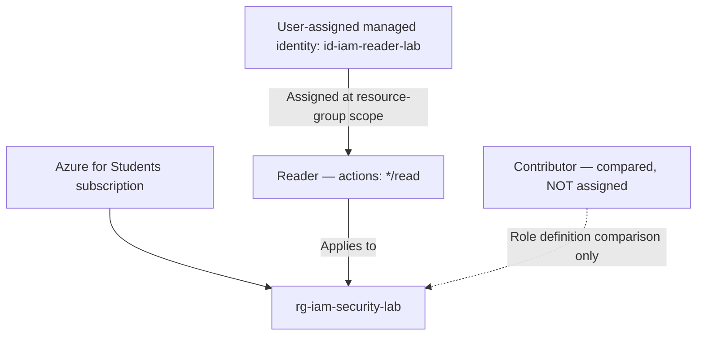

# RBAC scope diagram

```mermaid
flowchart TD
  S["Azure for Students subscription"]
  G["rg-iam-security-lab"]
  I["User-assigned managed identity: id-iam-reader-lab"]
  R["Reader — actions: */read"]
  C["Contributor — compared, NOT assigned"]

  S --> G
  I -->|"Assigned at resource-group scope"| R
  R -->|"Applies to"| G
  C -.->|"Role definition comparison only"| G
```

The diagram depicts **configuration**, not authenticated managed-identity API activity.
